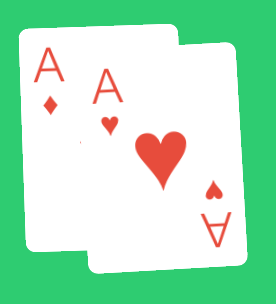

PlayingCardView
===============

This is an implementation of a playing card as a UIView. 



Features:
- Lightweight:  No images for the cards -- 100% code.
- Flexible: Since it’s code, you can tweak anything about the cards to fit your needs.
- Realistic Feel:  The included customizations make the cards feel more real


##Getting Started
===============
###Installation with CocoaPods

CocoaPods is a dependency manager for Objective-C, which automates and simplifies the process of using 3rd-party libraries in your projects.

In your Podfile, add the following lines:
```ios
platform :ios, '7.0'
pod "LCLPlayingCardView", "~> 1.0"
```

###Importing Headers
```ios
#import "LCLPlayingCardView.h"
```


##Usage
###Example Usage
```ios
NSInteger cardWidth = 80;
NSInteger cardHeight = 112;
CGRect cardRect = {{20, 280}, {cardWidth,cardHeight}};
LCLPlayingCardView *card = [[PlayingCardView alloc] initWithFrame:cardRect withRank:@"2" withSuit:@"♠" isVisible:YES];
```

###Instance Methods
```ios
- (void)flipCard;
- (void)tiltCardWithDegrees:(float)degrees
- (void)tiltCardRandomly
```


##License


##Change Log


##Future Improvements
